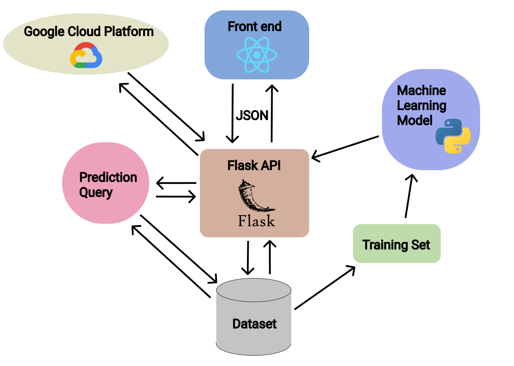

# Iris - An AI powered marketing solution

## The Goal

Over the past few decades, small businesses have been significantly affected by the rapid growth of large corporations. With the amount of money companies have to push campaigns in today's market, marketing and determining the target market has become a difficult and costly process for local businesses. Our team values the importance of the local businesses, therefore we felt that this is a socioeconomic issue that we must address. Out goal is to create an application that provides business owners the information needed to expand their business. 

## What does Iris do?
Iris collects information from a rich dataset and presents it's findings in a way where business owners can quickly learn which locations and demographics they should market rigorously. Some information given back is the average target market and a location for what community your market lives in. 

To determine the best output, a number of factors are used. Such factors include business type, average target market age, average target market income, business rent price, etc. 

## Demo

ENTER DEMO IMAGES

## How we built it 
We split our projects into four parts: UX/UI design, frontend, backend api, and machine learning model. Through git workflow, we were able to delegate tasks and modularize our project to guarantee smooth collaboration. 

Starting with the UX/UI section of the project. We used a number of tools such as Figma for prototyping, Bootstrap for design components, and Google maps API for maps. Our goal was to make a modern, clean, and user-friendly user interface. 

Moving onto the frontend, we used React to create a light and efficient framework that made it very easy to handle state, routing, and creating dynamic pages. 

BACK EIn the backend, we mainly used a Flask API to handle post requests from the React frontend. Additional microservices are also handled through the API, where the flask server is connected to the machine learning model. To deploy the application, we hosted it on a Google Cloud platform. ND PART

MACHINE LEARNING PART

> Project structure diagram

## A list of technologies used 

- Flask
- React
- Google cloud services
- Sci-kit learn
- Numpy
- Pandas
- Figma

## Challenges we ran into

FILL IN LATER

## Accomplishments we are proud of

## Things we learned
asdkasdhkaj

## So whats next ?
