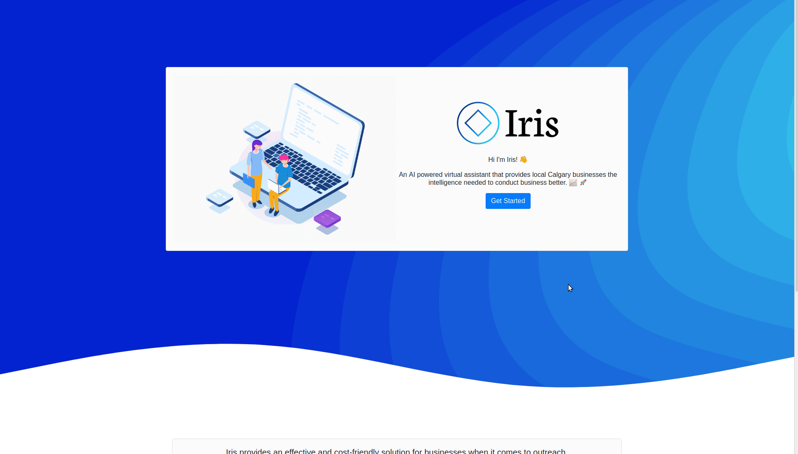
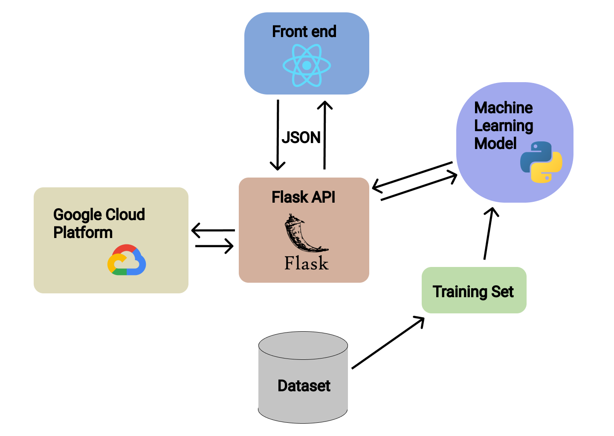

# Iris - Automate Your Strategy

## Demo

# The Goal

Small business employ 99.8% of Canadians, yet the Business Development Bank of Canada predicts that shifting age demographics, the rise of data-driven decision making and process automation threaten small businesses most. Small businesses lack the time, money and expertise to conduct the deep data analysis that large businesses with dedicted data science teams can do. Large business maintain consistent strategic advantage over small businesses, stifling competition and harming local growth. Its time to democratize data-driven decisions, and allow small businesses to develop strategy through data. 

Iris is a first step, we employ a wealth of data from the Calgary and Canadian Census, alongside Calgary GeoData, all processed through a K-Means-Clustering algorithm to recommend locations to small businesses, either for permenant activity, marketing, or popup shops, based on a customer profile generated by manual input or Canadian Census Data. 

# What does Iris do?

Iris uses a wealth of datasets, including Calgary Census, Household Income, Communities by Ward and Community Locations, alongside Canadian Household Spending datasets. Through this, it defines the average age and average income for each community. Using Canadian Census Data, we can also gbenerate a target age and income for a given sector. 

Iris uses K-Means-Clustering to cluster communities into groups based on similar age and income characteristics. Then, once the user inputs a target age and income, we use K-Means prediction to find which cluster that age and income belong to, then returning the neighbourhoods in that cluster. This matches a customer profile with the community in which that customer is most likely to reside. 

In short, we reduce costs on research, increase profits through targeted strategy and marketing, ultimately allowing small businesses to focus on what they do best, providing local, responsible, high-quality products.

# How we built it 
We split our projects into four parts: UX/UI design, Frontend, Backend API, and the Machine Learning model. Through git workflow, we were able to delegate tasks and modularize our project to guarantee smooth collaboration. 

Starting with the UX/UI section of the project. We used a number of tools such as Figma for prototyping, Bootstrap for design components, and Google maps API for maps. Our goal was to make a modern, clean, and user-friendly user interface. 

Moving onto the frontend, we used React to create a light and efficient framework that made it very easy to handle state, routing, and creating dynamic pages. 

Our Backend handles all data extraction, transformation and loading. We use Flask to handle HTTP requests and maintain an HTTP Server, the server is then hosted on Google Cloud. Unforunately, we were not able to host the front-end in a similar fashion. Our API uses Pandas as its primary tool to extract, transform and load data from CSV files into dataframes, and then filter and aggregate the data we need. 

Our Machine Learning pipeline uses K-Means-Clustering, an unsupervised learning algorithm (requires no label) that groups data points together based on similarity. We used pandas to feed data into the model for training, and on deployment, an API route exposes the model for prediction. We feel the model, like any, is limited by its data and could only perform better with more sophisticated data processing. 

## Diagram: 

> Project structure diagram

## A list of technologies used 

- Flask
- React
- Google cloud services
- Sci-kit learn
- Numpy
- Pandas
- Figma

## Challenges we ran into

The never-ending challenge in data science and machine learning is not what to do, but how to do it, and likewise our biggest challenge was finding a method to predict communities based on certain characteristics. I looked at a lot of different methods, such as taking a simple average, multi-objective optimization, but ultimately settled on K-Means for familiarity and simplicity. 

Data extraction and loading was also a new challenge. I'm not the most familiar with building data pipelines, but I feel I adapted well to the challenge and was able to efficiently (but not cleanly) extract the data we needed with a lot of head-scratching, diagrams and coffee. 

Lastly, making our entire system work was a challenge in itself. We found issues with our use case such as populating fields with an API response, and learning MapBox (luckily a less steep learning curve than expected). However, we persevered. 

## Accomplishments we are proud of

That it works at all! We came in with a wide scope and ambitious plan. I'm vaguely familiar with unsupervised learning, but I certainly didn't know how to implement K-Means. I was over the moon when my data pipeline worked and K-Means gave a real result. Given that, I do feel that our K-Means model is relatively accurate for its development timeline.

Our data pipeline is also surprisingly fast, getting up and running within a second, which I achieved through extensive optimization of dataframe operations, but I'm proud of how well it performs.

I'm also incredibly proud of our work on the frontend, as I (the writer) am largely a backend and data developer, I was floored by how good our UI looked, and I give full credit for that to my team.

## Things we learned
Oh where to begin?

* How to design a gorgeous UI
* How to pipeline raw csv data to a useful dataframe
* How K-Means works and how to use it
* The fine art of model hyperparameter tuning
* A lesson I learn every hackathon, never underestimate what you and your team can do.

## So whats next ?
* Adding a more sophisticated data model, considering other factors such as pedestrian traffic, rent, crime etc.
* Employing a more sophisticated consumer profile generation system, using more than just census data to reduce research time for users. 
* Deployment and hosting so small businesses can use this as it was intended.